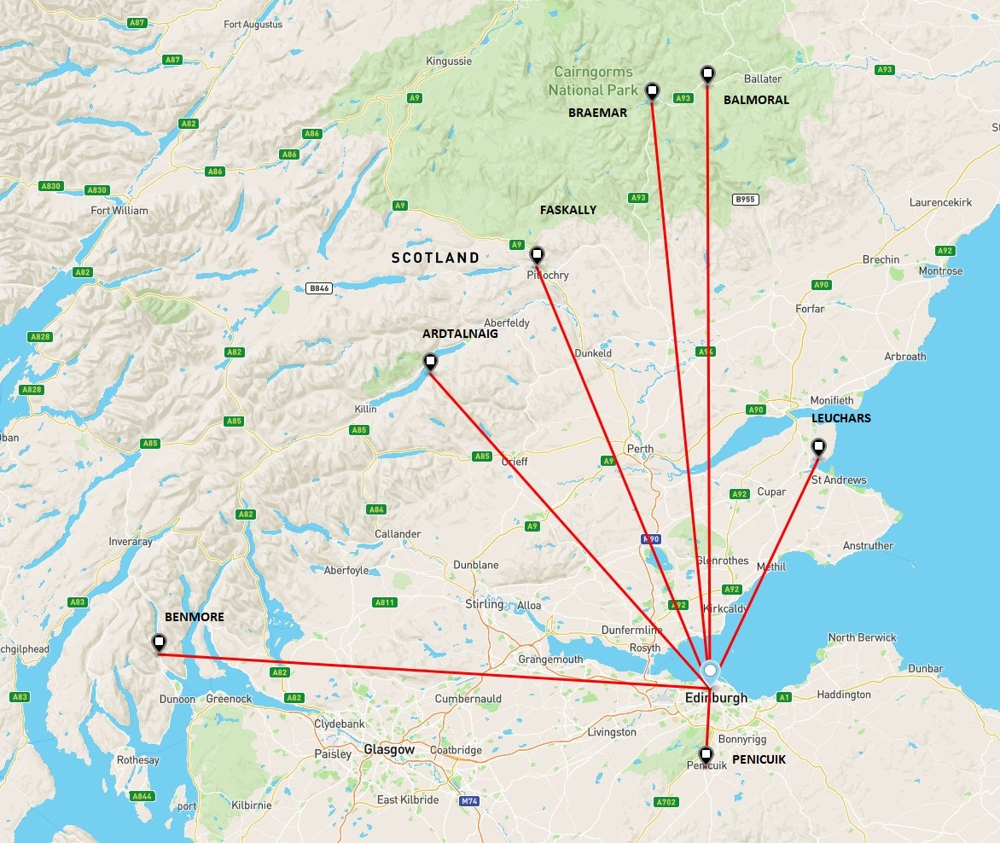

```{r setup, include = FALSE}
# Set default code chunk options
knitr::opts_chunk$set(
  echo = TRUE, # Note: the code_folding option above will hide code until the
               #       a button to view it 
  eval = TRUE
)
```

# Weather data

```{r my-setup}
# Modify this code chunk to add extra packages etc if needed,
# and to load the weather data.

# Load function definitions
source("my_functions.R")

# Load common packages
suppressPackageStartupMessages(library(tidyverse))
suppressPackageStartupMessages(library(StatCompLab))
theme_set(theme_bw())

```

This report will be analysing data from the Global Historical Climatology 
Network at https://www.ncdc.noaa.gov/data-access/land-based-station-data/land-based-datasets/global-historical-climatology-network-ghcn. 
I will be specifically looking at data from eight weather stations in Scotland.
The data includes the minimum temperature, `TMIN`, maximum temperature, `TMAX`,
and precipitation, `PRCP`, recorded every day (when possible to) between 1960 - 2018. Below
you will find the eight Scottish weather stations and their location in latitude,
longitude and elevation(meters) above sea level, along with their respective IDs:

```{r station_info}
station_info <- readRDS(file = "data/station_info.rds")

knitr::kable(station_info)
```


# Climate trends

## Monthly Trends

To assess whether there is a long-term temporal trend in the minimum temperature
, `TMIN`, at each station for each month, I will first display whether a 
trend even exists in January for all stations. Below you will find a graph of the observed average 
TMIN for January against years, from 1960 to 2018. The red line represents an estimated linear
model given by: $\overline{TMIN}_{m(t)} = \beta(Year) + c$ and the grey band is
95% predicition interval. $\beta$ represents the long-term temporal trend
and $c$ represents the estimated average `TMIN` for that month, $\overline{TMIN}_{m(t)}$
at year 0. Therefore, for predicting $\overline{TMIN}_{m(t)}$ pre-1960 and post
2018 will be interpolating the data and should be done with caution.

```{r January_TMINBAR}
seasonal_TMIN <- readRDS(file = "data/seasonal_TMIN.rds")
Jan_pred <- readRDS(file = "data/Jan_pred.rds")

ggplot(Jan_pred, mapping = aes(Year, pred.fit)) +
  geom_line(Jan_pred, mapping = aes(Year, pred.fit), colour = "Red") +
  geom_ribbon(mapping = aes(ymin = pred.lwr, ymax = pred.upr), alpha = 0.2) +
  geom_point(data = seasonal_TMIN %>%
               filter(Month == 1), aes(Year, TMINBAR)) +
  ylab("TMINBAR") +
  facet_wrap(~ Name) +
  ggtitle("January Trend")

```

The graph above shows there is a small positive trend the January average 
`TMIN` value against year. Therefore, it would be worthwhile to apply a linear 
model to all months and evaluate the year coefficient to see the long-term 
temporal trend. The graphs below shows each estimated long-term temporal trend 
per year for each month at all 8 stations, with 95% confidence intervals:

```{r trend_est}
trend_est <- readRDS(file = "data/trend_est.rds")
trend_est %>%
  group_by(ID, Name, Month) %>%
  ggplot(aes(Month, trend)) +
  geom_point() +
  geom_ribbon(aes(ymin = lwr, ymax = upr), alpha = 0.2)+
  geom_hline(yintercept=0) +
  scale_x_continuous(breaks = seq(0,12,1)) +
  ylab("Trend per year") +
  facet_wrap(~ Name) +
  ggtitle("Trend estimation per year for all months")
```

Since the estimated trend appears to be very small per year, I have scaled the estimated
trend to evaluate the change per century.
The graph below shows the results:
```{r trend_est_century}
trend_est <- readRDS(file = "data/trend_est.rds")

trend_est_scaled <- trend_est %>%
  mutate(trend_century = trend*100,
         lwr_century = lwr*100,
         upr_century = upr*100)

trend_est_scaled %>%
  group_by(ID, Name, Month) %>%
  ggplot(aes(Month, trend_century)) +
  geom_point() +
  geom_ribbon(aes(ymin = lwr_century, ymax = upr_century), alpha = 0.2)+
  geom_hline(yintercept=0) +
  scale_x_continuous(breaks = seq(0,12,1)) +
  ylab("Trend per century") +
  facet_wrap(~ Name) +
  ggtitle("Trend estimation per century for all months")
```

In the graph above, I have plotted the trend over a century for each month, and
each graph represents each of the 8 stations. The grey band represents the
95% confidence interval for the trend. \
The way in which we can interpret this graph is that the "Trend per century"
represents an change in average minimum temperature, `TMIN`, for that month
over a century.
For example, the weather station at Braemar is recording an increase in
average minimum temperature in February at approximately 5 degrees celsius per
century.\
What we observe is that there is generally a small positive trend over years for
the average monthly `TMIN` value. This means as time goes on we will see a small 
increase in average monthly `TMIN` value. However the trend is not consistent for
all months across all stations. The bar chart below will provide a visual representation
of the stability of the trend within the same month across stations. 

```{r trend_est_century_monthly}
trend_est <- readRDS(file = "data/trend_est.rds")

trend_est_scaled <- trend_est %>%
  mutate(trend_century = trend*100,
         lwr_century = lwr*100,
         upr_century = upr*100)

trend_est_scaled %>%
  ggplot(aes(Name, trend_century, fill = Name)) +
  geom_bar(stat = "identity") +
  theme(axis.title.x=element_blank(),
        axis.text.x=element_blank(),
        axis.ticks.x=element_blank()) +
  ylab("Trend per century") +
  facet_wrap(~ Month) +
  ggtitle("Trend estimation per century for all months by each month")
```

What we see in the plot above is that all stations, expect for Faskally, tend
to follow the same trend in every month. This is seen by the similarity in heights
per monthly plot. With the exception of Faskally where we tend to see dampened
or negative trend compared to others when considering the average `TMIN` value
per month. Furthermore, from the plot preceding the bar chart, the trend
per century over the months at each station all tend to follow the same pattern.
Including Faskally except it is shifted downward by about 2-3 degrees celsius.
These features can be attributed to the location of the station compared to the
others. Faskally is located between hills and elevated ground which is a unique 
geographic location. \
\
The most steady and largest trend across all stations exists in the months February and 
November. Conversely the least steady and lowest trends across all stations
exist in the months October and December. We will be exploring these months
further in the next section.\

### November Trends

```{r NOV_TMINBAR}
seasonal_TMIN <- readRDS(file = "data/seasonal_TMIN.rds")
Nov_pred <- readRDS(file = "data/Nov_pred.rds")
ggplot(Nov_pred, mapping = aes(Year, pred.fit)) +
  geom_line(Nov_pred, mapping = aes(Year, pred.fit), colour = "Red") +
  geom_ribbon(mapping = aes(ymin = pred.lwr, ymax = pred.upr), alpha = 0.2) +
  geom_point(data = seasonal_TMIN %>%
               filter(Month == 11), aes(Year, TMINBAR)) +
  ylab("TMINBAR") +
  facet_wrap(~ Name) +
  ggtitle("Novemeber Trend")
```

To further illustrate the differences in trends across months, the graph
above shows us the average `TMIN` value against year for the month of
November. We can see that there is a positive trend over time for all stations.
This would indicate to us that in November, the average `TMIN` is increasing over
time. Therefore, we see higher average minimum temperatures in November which means on
average it is not as cold as it has been in previous years. 

### October Trends
```{r Oct_TMINBAR}
seasonal_TMIN <- readRDS(file = "data/seasonal_TMIN.rds")
Oct_pred <- readRDS(file = "data/Oct_pred.rds")
ggplot(Oct_pred, mapping = aes(Year, pred.fit)) +
  geom_line(Oct_pred, mapping = aes(Year, pred.fit), colour = "Red") +
  geom_ribbon(mapping = aes(ymin = pred.lwr, ymax = pred.upr), alpha = 0.2) +
  geom_point(data = seasonal_TMIN %>%
               filter(Month == 10), aes(Year, TMINBAR)) +
  ylab("TMINBAR") +
  facet_wrap(~ Name) +
  ggtitle("October Trend")
```

In contrast, October seems to have a lower, and in some cases, negative trend 
over years. At the stations Benmore, Faskally and Ardtalnaig there is a slightly negative trend
over years. However, the estimated trend has some variance, so it would be 
reasonable to assume that there is no trend rather than a small negative trend.

### December Trends
```{r Dec_TMINBAR}
seasonal_TMIN <- readRDS(file = "data/seasonal_TMIN.rds")
Dec_pred <- readRDS(file = "data/Dec_pred.rds")
ggplot(Dec_pred, mapping = aes(Year, pred.fit)) +
  geom_line(Dec_pred, mapping = aes(Year, pred.fit), colour = "Red") +
  geom_ribbon(mapping = aes(ymin = pred.lwr, ymax = pred.upr), alpha = 0.2) +
  geom_point(data = seasonal_TMIN %>%
               filter(Month == 12), aes(Year, TMINBAR)) +
  ylab("TMINBAR") +
  facet_wrap(~ Name) +
  ggtitle("December Trend")
```

Similar characteristics are seen in December at all stations. However, it is
important to notice that there is more variability in the December estimated
trend. The more extreme observed average `TMIN` values fall outside of the 95%
prediction interval for the estimated model shown in the graphs above. 
In particular observed values below the 95% prediction interval\
\
We can conclude there there is generally a small upward trend over years for the
monthly average `TMIN` values at all stations in Scotland for most months.
Where there is no positive long-term temporal trend, we see that there is little to no
trend at all. This would be in line with what we generally see across the world. 
The trend seems the least prevalent in the November and December. Conversely, 
the trend seems more stable in the spring and summer seasons, with a steady
increase over time. This means the average monthly `TMIN` value is slowly and
steadily increasing over time, which is a sign of a slight increase in temperature.
However, we are only considering the average monthly `TMIN` value, perhaps the
daily `TMIN` or the average monthly `TMAX` value will present a different conclusion.

## Seasonally varying variability

To assess whether the temperature variability is the same for each month of the
year I will be looking at the Balmoral station daily `TMIN` residuals from the
month averages. I define the residuals as $R_t = T_t - \overline{T}_{m(t)}$, where $T_t$ is
`TMIN` at time $t$, and $\overline{T}_{m(t)}$ is the average `TMIN` value in the month of time
$t$. I will be testing whether the daily `TMIN` residuals within a month
are larger than the overall residual variance.\
Our hypotheses are:
$$
H_0: \text {The residual variance is the same for all months of the year} \\
H_1: \text {The residual variance for January is higher than the overall variance}
$$
and similarly for all other month.\
First, I will define the observed test statistic as
$$
\text{Test statistic} = var(R_{m(t)}) - var(R_t)
$$
which is to say, the difference in variance in a given month of time $t$ and 
the variance of the whole set of residuals. Since this is a one-sided test to 
see if the variance of the residual from one month is larger than the variance of
the set of residuals. I have formulated the test statistic to see the positive
difference.\
The observed test statistics are given in the table below:

```{r T_stat_obs}
T_Month <- readRDS(file = "data/T_Month.rds")
knitr::kable(T_Month)
```

Since there is a large number of possible permutations, beyond the capabilities
of my workstation, I will be performing a randomisation test to see if there is
sufficient evidence to reject the null hypothesis. \
The upper bound of the standard deviation of the p-value is given by $1/\sqrt{4M}$.
As a result, I have performed $2500$ permutations of the data to calculate the 
p-value to a standard deviation of 0.01.\
Below you will find a table of the calculated p-values for each month at the
Balmoral station:

```{r pvalues}
pvalues <- readRDS(file = "data/pvalues.rds")
knitr::kable(pvalues)
```

We can conclude from the table above that there is sufficient evidence to
reject the null hypothesis for January, February, November and December at
the 5% significance level whilst accounting for the standard deviation of the p-value.  
That is to say that the residual variance is not the 
same for those months of the year and it is higher than the overall variance. \
What is interesting to note is that these months, November to January, are the
winter months in Scotland. Therefore, we can interpret this as
more variation in `TMIN` temperature in the winter season when compared to the
rest of the year. This means that it can be colder and warmer compared it's monthly
average in the winter months.\
\
Another interesting observation is that during all other seasons the residual
variance is not greater than the overall residual variance, however that is not to
say it is not less than the overall residual variance. If I were to test for
a different alternative hypothesis:
$$
H_1: \text {The residual variance for January is} \textbf{ lower} \text{ than the overall variance}
$$
and similarly for all other months. Then I would expect to see sufficient evidence to reject null hypothesis in the
months between April-October at the 5% significance level.\
\
To conclude, there is sufficient evidence to reject the null hypothesis and to
say that the residual variance is not the same for all months of the year. Since
if we reject the null hypothesis for any of the 12 tests, then we would
reject the null hypothesis all together. 

# Spatial weather prediction

## Estimation

The weather station I have chosen to estimate a linear model for is Edinburgh:
Royal Botanic Garde. The linear model will predict the daily maximum temperature,
`TMAX`, at the Edinburgh weather station using the 7 other stations and Year as covariates.
I will estimate a linear model for each month of the year.\
Below you will find a table of the coefficients of all covariates and 
the intercept of the estimated linear model:

```{r Edin_model_table}
Edin_model <- readRDS(file = "data/Edin_model.rds")
knitr::kable(Edin_model)
```

To illustrate the interesting characteristics of the models, I have constructed
a graph below of the results plotted against the individual months:
```{r Edin_model_graph}
Edin_model <- readRDS(file = "data/Edin_model.rds")
ggplot(Edin_model) +
  geom_line(aes(Month, UKE00105874, colour = "BRAEMAR")) +
  geom_line(aes(Month, UKE00105875, colour = "BALMORAL")) +
  geom_line(aes(Month, UKE00105884, colour = "ARDTALNAIG")) +
  geom_line(aes(Month, UKE00105885, colour = "FASKALLY")) +
  geom_line(aes(Month, UKE00105886, colour = "LEUCHARS")) +
  geom_line(aes(Month, UKE00105887, colour = "PENICUIK")) +
  geom_line(aes(Month, UKE00105930, colour = "BENMORE: YOUNGER BOTANIC GARDE")) +
  geom_line(aes(Month, Year, colour = "Year")) +
  geom_point(aes(Month, UKE00105874, colour = "BRAEMAR")) +
  geom_point(aes(Month, UKE00105875, colour = "BALMORAL")) +
  geom_point(aes(Month, UKE00105884, colour = "ARDTALNAIG")) +
  geom_point(aes(Month, UKE00105885, colour = "FASKALLY")) +
  geom_point(aes(Month, UKE00105886, colour = "LEUCHARS")) +
  geom_point(aes(Month, UKE00105887, colour = "PENICUIK")) +
  geom_point(aes(Month, UKE00105930, colour = "BENMORE: YOUNGER BOTANIC GARDE")) +
  geom_point(aes(Month, Year, colour = "Year")) +
  geom_hline(yintercept=0) +
  scale_x_continuous(breaks = seq(0,12,1)) +
  ylab("Coefficient") +
  ggtitle("Edinburgh monthly model coefficients")
```

There are a few intriguing characteristics we can draw on from the estimated linear
models. Firstly, the coefficients for the year covariates are very small and almost
negligible. This means that year has little to no effect on the estimating the daily 
`TMAX` at the Edinburgh weather station compared to the other covariates. \
\
To assess the coefficient at each station on the daily `TMAX` prediction for the Edinburgh
weather station I have included an image of the location of all 8 weather stations, using GeoJSON.
The light blue marker is the Edinburgh weather station and the red lines are the distances to
the other stations.
```{r weather_station_map}

```

There are only two stations have a consistently positive relationship with the Edinburgh
weather station in all months, those are: Leuchars (UKE00105886) and Penicuik (UKE00105887).
The reason why we see the positive coefficients for Leuchars in our estimated model is
because of the short distance between the two stations and the similarity in elevation
from sea level. The distance between the two stations is approximately 50km, which
makes it the second closest station. Furthermore, difference in elevation is 
approximately 16m making it also the second closest in elevation.
As for Penicuik, it is the closest station to Edinburgh at approximately 16 km.
This would explain the positive relationship between the two weather stations
and their recorded `TMAX` temperature, despite having an elevation difference of
approximately 160m. \
\
On the other hand, the station Braemar (UKE00105874) has a small negative or negible relationship
with the Edinburgh weather station. We can attribute this to the large difference
in elevation, at 313m. The distance between the two is approximately 116 km, and
which is similar to the distance to Benmore, and we will see later an
interesting relationship between Edinburgh and Benmore stations. 
Therefore we can attribute the lack of a positive relationship due to the
difference in elevation.\
\
When assessing the coefficient for the Benmore: Younger Botanic Garde(UKE00105930)
weather station we see it has a positive relationship with the Edinburgh station
during the autumn and winter months (October-March) but little to no relationship
during the rest of the seasons. This is due to the geographic similarities between
the two stations. There is approximately 14m in elevation difference but the distance
between the two stations is approximately 110km. Furthermore, both weather stations
are situated at opposite coasts in Scotland. This helps explain the unusual
relationship and the coefficient. What we see is that both stations experience
similar daily `TMAX` during the autumn and winter months. \
\
Finally, the Faskally (UKE00105885) weather station has a interesting geographic
location when comparing to the Edinburgh weather station. With the elevation 
difference being 68m and the distance being 90km, we might expect a small
positive coefficient. However, this is not the case, since all coefficients
for that station is below 0.1 in all months expect July. The cause of this may
be the geographic location of the Faskally. This weather station is located
on a slight elevation and surround by larger hills and mountains. The valley
like positioning of this station has had an influence on the `TMAX` recorded.\
\
To demonstrate how effective the linear models for each month is at predicting
the daily `TMAX`, I have plotted the observed value at the Edinburgh weather station
against the predicted value from the linear model. Below we see the scatter plot
for all months:
```{r Edin_pred}
Edin_pred <- readRDS(file = "data/Edin_pred.rds")

ggplot(Edin_pred) +
  geom_point(shape=1, aes(True_value, pred)) +
  geom_abline(intercept = 0, slope = 1, col = "red") +
  xlab("Observed value") +
  ylab("Predicted value") +
  facet_wrap(~ Month) +
  ggtitle("Edinburgh: Observed vs Predicted")
```

The red line represents when the observed value is equal to the predicted value.
Therefore we can informally assess how good the estimated linear model is for
predicting the observed value visually. The closer the points are to the red
line the more accurate the prediction is and therefore a better the linear model. 
The residuals could be calculated by finding
the distance every point is from the red line. Predicted values which are less than
the observed value fall below the red line, and predicted values which are
greater than the observed values are above the red line. \
\
I would like to bring to your attention two models, firstly the November model:
```{r Edin_Nov_pred}
Edin_Nov_pred <- readRDS(file = "data/Edin_Nov_pred.rds")

ggplot(Edin_Nov_pred) +
  geom_point(shape=1, aes(True_value, pred)) +
  geom_abline(intercept = 0, slope = 1, col = "red") +
  ggtitle("November: Observed vs Predicted") +
  xlab("Observed value") +
  ylab("Predicted value")
```

A feature this scatter plot are that the points on the graph are generally
close to the red line and that would indicate the estimated linear model is fairly
accurate at predicting the true daily `TMAX` values. There are very 
few points which deviate from the red line.\
\
The second model is the May Model:
```{r Edin_May_pred}
Edin_May_pred <- readRDS(file = "data/Edin_May_pred.rds")

ggplot(Edin_May_pred) +
  geom_point(shape=1, aes(True_value, pred)) +
  geom_abline(intercept = 0, slope = 1, col = "red") +
  ggtitle("May: Observed vs Predicted") +
  xlab("Observed value") +
  ylab("Predicted value")
```

The features for the May scatter plot are the points seems to have a larger cluster width
around the red line. Also there are some points that the under predicted by up to 5 degrees.\
\
Informally, we can see that the November model is better at predicting the true
value than the May model for the Edinburgh weather station. In the next section, I will be
formally assessing this in the next section using the Absolute Error score and
Dawid-Sebastiani score. 

## Assessment

To assess the predictive power of each of the 12 models, I will be estimating the
absolute error score and the Dawid-Sebstiani scores for each of the models. To
estimate these scores I will be using a 10-fold cross-validation. This means
I will be randomingly splitting the data into 10 subsets; using 9 subsets
to train the model and the remaining subset will be used to validate the model.
The model will predict `TMAX` values for the validating data. From the predictions 
I will estimate the Absolute Error scores and Dawid-Sebastiani scores. Repeating 
this procedure 10 times will allow me to perform a 10-fold randomised cross-validation.
Therefore I will be using all 10 subsets of the data as validating data once, 
for each of the 12 models. By taking the average of the
scores, we will have estimated the Absolute Error score and Dawid-Sebastiani
and its standard deviation.\
It must be noted that in an ideal scenario, the size of the data for each month
would be divisible by 10, so that the sizes of all 10 subsets could be the same.
However, this is not the case and resulted in some subsets being one observation larger
than others.\
Below you will find a table of my results from the 10-fold cross-validation
estimation of the Absolute Error and Dawid-Sebastiani scores:

```{r Score_table}
score_summary <- readRDS(file = "data/score_summary.rds")
knitr::kable(score_summary)
```

The results of the table are better analysed by the following graph:

```{r Score_graph}
score_summary_confint <- readRDS(file = "data/score_summary_confint.rds")
score_summary_confint %>%
  ggplot() +
  geom_point(aes(Month, mean_ae, colour = "Absolute Error score")) +
  geom_point(aes(Month, mean_ds, colour = "Dawid-Sebastiani score")) +
  geom_line(aes(Month, mean_ae, colour = "Absolute Error score")) +
  geom_line(aes(Month, mean_ds, colour = "Dawid-Sebastiani score")) +
  geom_ribbon(mapping = aes(x= Month, ymin = ae_lwr, ymax = ae_upr, fill = "Absolute Error score"), alpha = 0.2) +
  geom_ribbon(mapping = aes(x = Month, ymin = ds_lwr, ymax = ds_upr, fill = "Dawid-Sebastiani score"), alpha = 0.2) +
  scale_x_continuous(breaks = seq(0,12,1)) +
  ylab("Mean score") +
  ggtitle("Proper score graph")
```

We can see that the general trend for the Absolute Error score and Dawid-Sebastiani 
score for each of the model are the same. That is to say that the linear models
estimating the `TMAX` values in the winter months (October-February) are generally
better models than the summer months models. Both the Absolute Error score and
Dawid-Sebastiani scores support this statement. \
The May model produces the worst scores which is highlighted by the
peak in the graph. The best performing model is the November model, which is
highlighted by the lowest points on the graph. \
An interesting feature of these results is that the Dawid-Sebastiani 
shows a more exaggerated trend when looking at the monthly model against scores 
compared to the Absolute Error score. An explanation for this is that the
calculation of the Absolute Error score is:

$$
S_{AE}(F,y) = |y- \widehat{y}_F|
$$
where, $y$ is the true value and $\widehat{y}_F$ is a point estimate under $F$,
the predictive median. This means when calculating the absolute error score 
only considers the error, which is the difference between the predicted value
and the true value. \
\
In contrast, the calculation of Dawid-Sebastiani score is given by:

$$
S_{DS}(F,y) = \frac{(y- \mu_F)^2}{\sigma^2_F} + log(\sigma^2_F)
$$
where $\mu_F$ is the predictive mean and $\sigma^2_F$ is the predictive variance
under $F$. This means that the score also depends on the predictive variance 
which the the Absolute Error score did not include. We can see from the formula
above that a larger predictive variance, $\sigma^2_F$, will decrease the first term but increase second
term of the Dawid-Sebastiani score. Considering we will generally be dealing with standard
deviations less than 1, then we will also be dealing with variance less than 1.
As a result, as variance increases the first term will decrease and the second
term will increase, however the second  term will always be negative due to 
taking the $log$ of the variance. \
Consequently, we see a lower and better Dawid-Sebastiani scores when the predictive 
variance is lower, like in the November model. On the other hand, we see larger and worse
Dawid-Sebastiani scores when the predictive variance is higher. For example, the May model
has a standard deviation and variance larger than 1, which makes the $log$ term
positive. This is why the trend of the scores are similar between the Absolute 
Error score and Dawid-Sebastiani score, however the latter has a penalty for 
large variance in predictions. 


# Code appendix

## Function definitions

```{r code=readLines("my_functions.R"), eval=FALSE}
```

## Analysis code

```{r code=readLines("my_code.R"), eval=FALSE}
```
